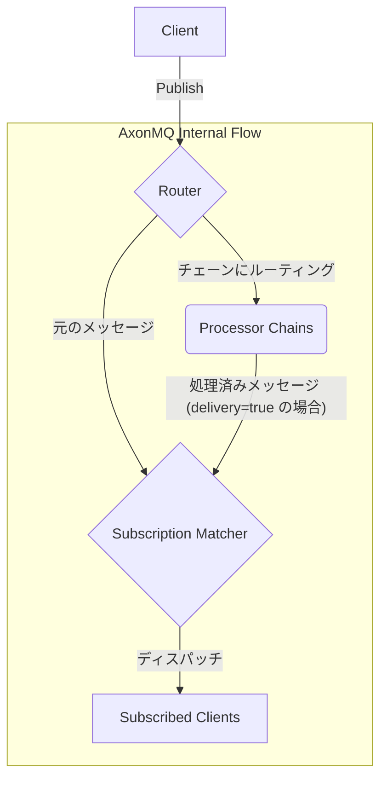

# AxonMQ: ネイティブSparkplug Bをサポートする高性能MQTTブローカー

このドキュメントは他の言語でもご覧いただけます：[English](README.md) | [繁體中文](README.zh-TW.md) | [简体中文](README.zh-CN.md)

---

AxonMQは、信頼性とスケーラビリティを重視して設計された、Rust製の軽量で高性能な **MQTTブローカー** です。内蔵された **Sparkplug B** ホストアプリケーションを特徴とし、産業用IoT (IIoT) のデータ収集やリアルタイムメッセージングのための強力でインテリジェントなハブとして機能します。

### ✨ 主な特徴

- **ネイティブSparkplug Bサポート**: 追加設定なしでステートフルなSparkplug Bホストアプリケーションとして機能し、ペイロードをデコードしてネットワークトポロジ全体の状態を管理します。
- **マルチプロトコル対応**: TCP、TLS、WebSocket (WS)、セキュアWebSocket (WSS) 上でMQTT v3.1.1およびv5.0をサポート。
- **高性能**: Tokioをベースに構築され、Rustのパフォーマンスと安全性を活用し、低遅延・高スループットのメッセージ配信を実現。
- **軽量**: 最小限のリソースフットプリントで、わずか20MBのメモリで起動可能。環境目標を念頭に設計されており、リソース消費、電力消費、CO2排出量の削減を目指します。
- **拡張可能な処理パイプライン**: 強力なプロセッサーチェーンでデータフローをカスタマイズし、フィルタリング、変更、統合を可能にします。WASMによるカスタムプロセッサーをサポートします。
- **設定可能**: シンプルな`config.toml`ファイルを通じて、リスナー、TLS設定、その他のパラメータを簡単に設定可能。
- **クロスプラットフォーム**: Linux、macOS、Windowsを含む主要なプラットフォームでコンパイル・実行可能。

## アーキテクチャ

### メッセージフロー

以下の図は、AxonMQ内の高レベルなメッセージフローを示しています：



1.  クライアントがメッセージをパブリッシュします。
2.  メッセージは **ルーター** に入ります。
3.  ルーターはメッセージをディスパッチします：
    -   元のメッセージは、標準的な配信のために **サブスクリプションマッチャー** に進みます。
    -   コピーが、カスタム処理のために一致する **プロセッサーチェーン** に送信されます。
4.  プロセッサーチェーンが `delivery = true` で設定されている場合、チェーンから出力されたメッセージ（変更されている可能性があります）も **サブスクリプションマッチャー** に送信されます。
5.  マッチャーは、該当するトピックを購読しているすべてのクライアントを見つけ、適切なメッセージをそれらにディスパッチします。

### 💎 サポートされているMQTT機能

| 機能                     | サポート | 注釈                                |
| ------------------------ | :------: | ----------------------------------- |
| MQTTプロトコルバージョン | v3.1.1, v5.0 |                                     |
| QoS 0 (At most once)     |    ✔️     |                                     |
| QoS 1 (At least once)    |    ✔️     |                                     |
| QoS 2 (Exactly once)     |    ✔️     |                                     |
| 維持メッセージ (Retained) |    ✔️     |                                     |
| 遺言メッセージ (Last Will) |    ✔️     |                                     |
| 永続セッション (Persistent) |    ✔️     | `clean_start = false` の場合        |
| 共有サブスクリプション (Shared) |    ✔️     | MQTT v5 機能 (`$share/...`)         |
| メッセージ有効期限 (Expiry) |    ✔️     | MQTT v5 機能                        |

### 📚 ドキュメンテーション

アーキテクチャと高度な機能に関する詳細については、公式ドキュメントを参照してください：

- **[ルーターガイド](./docs/router.md)**: ルーティングルールの設定方法を学びます。
- **[プロセッサーガイド](./docs/processor.md)**: ネイティブRustまたはWebAssembly（WASM）でデータパイプラインを拡張する方法を理解します。
- **[CLI 利用ガイド](./docs/cli-usage.md)**: コマンドラインインターフェースの利用方法を学ぶ。

### 🚀 クイックスタート

#### 0. リリースからダウンロード

様々なプラットフォーム向けのビルド済みパッケージは、[GitHubリリース](https://github.com/letoille/AxonMQ/releases)ページから入手できます。`.deb` (Debian/Ubuntu用)、`.rpm` (Rocky Linux/Centos用)、`.zip` (Windows用) パッケージを直接ダウンロードして使用できます。

#### 1. ソースからビルド

Rustツールチェーンがインストールされていることを確認してください。

```bash
git clone https://github.com/letoille/AxonMQ.git
cd AxonMQ
cargo build --release
```

#### 2. AxonMQの設定

`config.toml`ファイルを編集して、希望のリスナーを設定します。デフォルトでは、リスナーは`127.0.0.1`にバインドされています。他のマシンからブローカーにアクセスする必要がある場合は、`127.0.0.1`を`0.0.0.0`（利用可能なすべてのネットワークインターフェースにバインド）または特定のIPアドレスに変更してください。ローカルテストの場合、デフォルトの`127.0.0.1`で十分です。


#### 3. ブローカーの実行

```bash
./target/release/axonmq
```

ブローカーが起動し、ステータスがコンソールに出力されます。

### 🔒 セキュリティノート: TLS証明書

**警告:** `certs`ディレクトリに含まれている証明書は、デモンストレーションおよびテスト目的のものです。これらは安全ではなく、本番環境では**絶対に使用しないでください**。

実際のデプロイでは、`certs/server.crt`と`certs/server.key`を独自の証明書に置き換える必要があります。

- **本番環境向け**: [Let's Encrypt](https://letsencrypt.org/)のような信頼できる認証局（CA）によって発行された証明書を使用することを強くお勧めします。
- **開発/テスト向け**: 新しい自己署名証明書を生成する必要がある場合は、以下の`openssl`コマンドを使用できます。これは、デフォルトで公開されている証明書を使用するよりも安全です。

```bash
# 新しい秘密鍵と自己署名証明書を生成
openssl req -x509 -newkey rsa:2048 -nodes -keyout server.key -out server.crt -days 3650 -subj "/CN=localhost"
```
このコマンドは、`localhost`ドメイン用の有効期間10年の証明書を作成します。MQTTクライアント側では、この自己署名証明書を信頼するように設定する必要があります。

### 📜 ライセンス

このプロジェクトは **Business Source License 1.1** の下でライセンスされています。詳細については `LICENSE` ファイルをご覧ください。

### 💡 今後の計画

AxonMQは継続的に機能強化を進めています。今後のリリースで計画されている主要な機能は以下の通りです：

- **クラスタデプロイメントのサポート**: クラスタデプロイメント機能を通じて、高可用性と水平スケーラビリティを実現。
- **Webベースの管理コンソール**: AxonMQブローカーの監視、管理、設定を行うためのユーザーフレンドリーなWebインターフェース。
- **アクセス制御リスト (ACL) のサポート**: クライアントのトピック公開および購読権限を管理するための堅牢なACLを実装。
- **ディスクベースの永続化**: メッセージとクライアントセッションの堅牢な永続化を実装し、ブローカー再起動時のデータ整合性を確保。
- **高度な認証**: クライアント証明書認証、LDAP、OAuth/JWT、その他の外部認証メカニズムをサポート。
- **ブローカーブリッジ/フェデレーション**: 複数のAxonMQインスタンスを接続したり、他のMQTTブローカーへのブリッジを可能にし、分散デプロイメントを実現。
- **メトリクスと監視の統合**: PrometheusやGrafanaなどの監視ツールとの統合のための包括的なメトリクスを提供。
- **強化されたプラグインアーキテクチャ**: 現在のデータプロセッサー機能を超えてプラグインシステムをさらに発展させ、データブリッジング、データストレージ、カスタム認証などのより多くの拡張ポイントをサポートします。
- **MQTT-SNのサポート**: 制約のあるIoTデバイス向けにMQTT-SNプロトコルのサポートを追加。

### 🤝 貢献

貢献、Issue、機能リクエストを歓迎します！お気軽に [issuesページ](https://github.com/letoille/AxonMQ/issues) をご確認ください。
