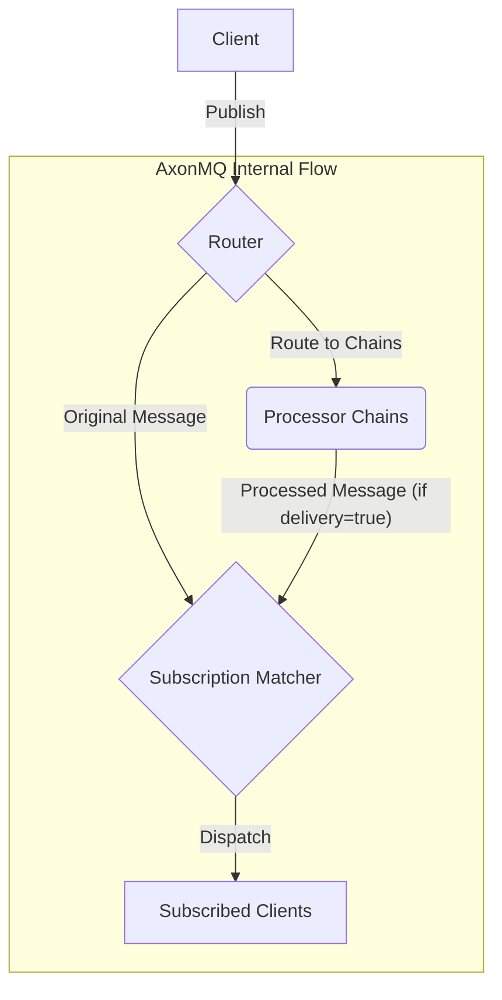

# AxonMQ: A High-Performance MQTT Broker with Native Sparkplug B Support

This document is also available in: [繁體中文](README.zh-TW.md) | [日本語](README.ja.md) | [简体中文](README.zh-CN.md)

---

AxonMQ is a lightweight, high-performance **MQTT broker** built in Rust, designed for reliability and scalability. It features a built-in **Sparkplug B** Host Application, making it a powerful and intelligent hub for Industrial IoT (IIoT) data collection and real-time messaging.

### ✨ Features

- **Native Sparkplug B Support**: Acts as a stateful Sparkplug B Host Application out-of-the-box, decoding payloads and managing the state of the entire network topology.
- **Multi-Protocol Support**: MQTT v3.1.1 and v5.0 over TCP, TLS, WebSocket (WS), and Secure WebSocket (WSS).
- **High Performance**: Built on Tokio, leveraging Rust's performance and safety features for low-latency, high-throughput message delivery.
- **Lightweight**: Minimal resource footprint, capable of starting with as little as 20MB of memory. Designed with environmental goals in mind, it aims to use fewer resources, consume less power, and emit less CO2.
- **Extensible Processing Pipeline**: Customize data flows with a powerful processor chain, allowing for filtering, modification, and integration. Supports custom processors via WASM.
- **Configurable**: Easily configure listeners, TLS settings, and other parameters via a simple `config.toml` file.
- **Cross-Platform**: Compiles and runs on major platforms including Linux, macOS, and Windows.

## Architecture

### Message Flow

The following diagram illustrates the high-level message flow within AxonMQ:



1.  A client publishes a message.
2.  The message enters the **Router**.
3.  The Router dispatches the message:
    -   The original message proceeds to the **Subscription Matcher** for standard delivery.
    -   A copy is sent to any matching **Processor Chains** for custom processing.
4.  If a Processor Chain is configured with `delivery = true`, the message that exits the chain (which could be modified) is **also** sent to the **Subscription Matcher**.
5.  The Matcher finds all subscribed clients and dispatches the appropriate messages to them.

### 💎 Supported MQTT Features

| Feature                  | Support | Notes                               |
| ------------------------ | :-----: | ----------------------------------- |
| MQTT Protocol Versions   | v3.1.1, v5.0 |                                     |
| QoS 0 (At most once)     |    ✔️    |                                     |
| QoS 1 (At least once)    |    ✔️    |                                     |
| QoS 2 (Exactly once)     |    ✔️    |                                     |
| Retained Messages        |    ✔️    |                                     |
| Last Will & Testament    |    ✔️    |                                     |
| Persistent Sessions      |    ✔️    | For `clean_start = false`           |
| Shared Subscriptions     |    ✔️    | MQTT v5 feature (`$share/...`)      |
| Message Expiry           |    ✔️    | MQTT v5 feature                     |
| Topic Alias              |    ✔️    | MQTT v5 feature                     |

### 📚 Documentation

For detailed information about the architecture and advanced features, please refer to our official documentation:

- **[Router Guide](./docs/router.md)**: Learn how to configure routing rules.
- **[Processor Guide](./docs/processor.md)**: Extend the data pipeline with native Rust or WebAssembly (WASM) processors.
- **[Sparkplug B Guide](./docs/sparkplugb/overview.md)**: Understand the built-in Sparkplug B Host Application.
- **[CLI Usage Guide](./docs/cli-usage.md)**: Learn how to use the command-line interface.
- **[MQTT Test Cases](./docs/test_cases.md)**: Detailed test cases for MQTT compliance.

### 🚀 Getting Started

#### 0. Download from Releases

Pre-built packages for various platforms are available on the [GitHub Releases page](https://github.com/letoille/AxonMQ/releases). You can download `.deb` (for Debian/Ubuntu), `.rpm` (for Rocky Linux/Centos), and `.zip` (for Windows) packages directly.

#### 1. Build from Source

Ensure you have the Rust toolchain installed.

```bash
git clone https://github.com/letoille/AxonMQ.git
cd AxonMQ
cargo build --release
```

#### 2. Configure AxonMQ

Edit the `config.toml` file to set up your desired listeners. By default, listeners are bound to `127.0.0.1`. If you need to access the broker from other machines, change `127.0.0.1` to `0.0.0.0` (to bind to all available network interfaces) or a specific IP address. For local testing, the default `127.0.0.1` is sufficient.

#### 3. Run the Broker

```bash
./target/release/axonmq
```

The broker will start and log its status to the console.

### 🔒 Security Note: TLS Certificates

**Warning:** The certificates included in the `certs` directory are for demonstration and testing purposes only. They are insecure and **must not** be used in a production environment.

For any real deployment, you should replace `certs/server.crt` and `certs/server.key` with your own certificates.

- **For Production**: It is highly recommended to use certificates issued by a trusted Certificate Authority (CA), such as [Let's Encrypt](https://letsencrypt.org/).
- **For Development/Testing**: If you need to generate a new self-signed certificate, you can use the following `openssl` command. This is more secure than using the default, publicly known certificate.

```bash
# Generate a new private key and self-signed certificate
openssl req -x509 -newkey rsa:2048 -nodes -keyout server.key -out server.crt -days 3650 -subj "/CN=localhost"
```
This command creates a certificate valid for 10 years for the domain `localhost`. Your MQTT clients will still need to be configured to trust this self-signed certificate.

### 📜 License

This project is licensed under the **Business Source License 1.1**. Please see the `LICENSE` file for full details.

### 💡 Future Plans

We are continuously working to enhance AxonMQ. Here are some key features planned for future releases:

- **Cluster Deployment Support**: Enable high-availability and horizontal scalability through cluster deployment capabilities.
- **Web-based Management Console**: A user-friendly web interface for monitoring, managing, and configuring the AxonMQ broker.
- **Access Control List (ACL) Support**: Implement robust ACLs to manage client permissions for publishing and subscribing to topics.
- **Disk-based Persistence**: Implement robust persistence for messages and client sessions to ensure data integrity across broker restarts.
- **Advanced Authentication**: Support for client certificate authentication, LDAP, OAuth/JWT, and other external authentication mechanisms.
- **Broker Bridging/Federation**: Allow connecting multiple AxonMQ instances or bridging to other MQTT brokers for distributed deployments.
- **Metrics & Monitoring Integration**: Provide comprehensive metrics for integration with monitoring tools like Prometheus and Grafana.
- **Enhanced Pluggable Architecture**: Further develop the plugin system beyond the current data processor capabilities to support more extension points, such as data bridging, data storage, and custom authentication.
- **MQTT-SN Support**: Add support for MQTT-SN protocol for constrained IoT devices.

### 🤝 Contributing

Contributions, issues, and feature requests are welcome! Feel free to check the [issues page](https://github.com/letoille/AxonMQ/issues).
