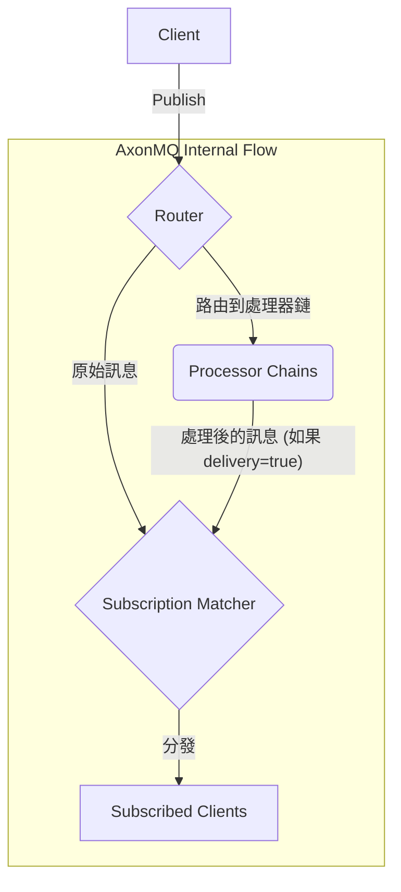

# AxonMQ: 一款原生支援 Sparkplug B 的高效能 MQTT 代理

本文件另有以下語言版本：[English](README.md) | [日本語](README.ja.md) | [简体中文](README.zh-CN.md)

---

AxonMQ 是一款基於 Rust 建構的輕量級、高效能 **MQTT 代理 (MQTT Broker)**，為可靠性與可擴展性而設計。它內建了一個 **Sparkplug B** 主機應用程式 (Host Application)，使其成為一個強大的、用於工業物聯網 (IIoT) 資料收集和即時訊息傳遞的智能中心。

### ✨ 功能特性

- **原生 Sparkplug B 支援**: 開箱即用，可作為一個有狀態的 Sparkplug B 主機應用程式，解碼訊息負載並管理整個網路拓撲的狀態。
- **多協定支援**: 支援基於 TCP、TLS、WebSocket (WS) 和 Secure WebSocket (WSS) 的 MQTT v3.1.1 和 v5.0。
- **高效能**: 基於 Tokio 建構，充分利用 Rust 的高效能和安全特性，實現低延遲、高吞吐量的訊息傳遞。
- **輕量級**：資源佔用極低，僅需 20MB 記憶體即可啟動。以環保為目標，旨在消耗更少的資源、更少的電量，並排放更少的二氧化碳。
- **可擴展的處理管道**: 透過強大的處理器鏈自訂資料流，允許過濾、修改和整合。支援透過 WASM 實現自訂處理器。
- **可設定**: 透過簡單的 `config.toml` 檔案輕鬆設定接聽器、TLS 設定及其他參數。
- **跨平台**: 可在包括 Linux、macOS 和 Windows 在內的主流平台上編譯和執行。

## 架構

### 訊息流

下圖說明了 AxonMQ 內部的高層訊息流：



1.  客戶端發佈一條訊息。
2.  訊息進入 **Router** (路由器)。
3.  路由器分派訊息：
    -   原始訊息流向 **Subscription Matcher** (訂閱匹配器) 以進行標準投遞。
    -   一個副本被發送到匹配的 **Processor Chains** (處理器鏈) 進行自訂處理。
4.  如果處理器鏈被配置為 `delivery = true`，那麼從鏈中出來的訊息（可能已被修改）也**同樣會**被送往 **Subscription Matcher**。
5.  匹配器找到所有訂閱相應主題的客戶端，並將相應的訊息分派給它們。

### 💎 支援的 MQTT 特性

| 功能                     | 支援度 | 備註                                |
| ------------------------ | :----: | ----------------------------------- |
| MQTT 協定版本            | v3.1.1, v5.0 |                                     |
| QoS 0 (最多一次)         |   ✔️    |                                     |
| QoS 1 (至少一次)         |   ✔️    |                                     |
| QoS 2 (僅有一次)         |   ✔️    |                                     |
| 保留訊息 (Retained)      |   ✔️    |                                     |
| 遺囑訊息 (Last Will)     |   ✔️    |                                     |
| 持久性會話 (Persistent)  |   ✔️    | 針對 `clean_start = false`          |
| 共享訂閱 (Shared)        |   ✔️    | MQTT v5 特性 (`$share/...`)         |
| 訊息過期 (Expiry)        |   ✔️    | MQTT v5 特性                        |
| 主題別名 (Topic Alias)   |   ✔️    | MQTT v5 特性                        |

### 📚 文件

有關架構和進階功能的詳細資訊，請參閱我們的官方文件：

- **[路由指南](./docs/router.md)**: 了解如何設定路由規則。
- **[處理器指南](./docs/processor.md)**: 了解如何使用原生 Rust 或 WebAssembly (WASM) 擴展資料管道。
- **[Sparkplug B 指南](./docs/sparkplugb/overview.md)**: 了解內建的 Sparkplug B 主機應用程式。
- **[CLI 使用指南](./docs/cli-usage.md)**: 學習如何使用命令列工具。
- **[MQTT 測試案例](./docs/test_cases.md)**: 詳細的 MQTT 合規性測試案例。

### 🚀 快速入門

#### 0. 從發布頁面下載

針對不同平台預先建置的套件可在 [GitHub 發布頁面](https://github.com/letoille/AxonMQ/releases) 取得。您可以直接下載 `.deb` (適用於 Debian/Ubuntu)、`.rpm` (適用於 Rocky Linux/Centos) 和 `.zip` (適用於 Windows) 套件。

#### 1. 從源碼建置

確保您已經安裝了 Rust 工具鏈。

```bash
git clone https://github.com/letoille/AxonMQ.git
cd AxonMQ
cargo build --release
```

#### 2. 設定 AxonMQ

編輯 `config.toml` 檔案以設定您需要的接聽器。預設情況下，接聽器綁定到 `127.0.0.1`。如果您需要從其他機器存取代理，請將 `127.0.0.1` 更改為 `0.0.0.0`（綁定到所有可用的網路介面）或特定的 IP 位址。對於本機測試，預設的 `127.0.0.1` 已足夠。


#### 3. 執行代理

```bash
./target/release/axonmq
```

代理服務將會啟動，並在主控台輸出其狀態。

### 🔒 安全提示：TLS 憑證

**警告：** `certs` 目錄中包含的憑證僅用於示範和測試目的。它們是不安全的，**絕對不能**在生產環境中使用。

在任何正式部署中，您都應該將 `certs/server.crt` 和 `certs/server.key` 替換為您自己的憑證。

- **生產環境**：強烈建議使用由受信任的憑證頒發機構 (CA) 簽發的憑證，例如 [Let's Encrypt](https://letsencrypt.org/)。
- **開發/測試環境**：如果您需要生成新的自簽名憑證，可以使用以下 `openssl` 命令。這比使用預設的、公開的憑證更安全。

```bash
# 生成新的私鑰和自簽名憑證
openssl req -x509 -newkey rsa:2048 -nodes -keyout server.key -out server.crt -days 3650 -subj "/CN=localhost"
```
此命令會為 `localhost` 域名建立一個有效期為 10 年的憑證。您的 MQTT 客戶端仍然需要設定為信任此自簽名憑證。

### 📜 授權條款

本專案採用 **Business Source License 1.1** 授權。完整資訊請參閱 `LICENSE` 檔案。

### 💡 未來規劃

我們正在持續改進 AxonMQ。以下是未來版本中計劃推出的一些主要功能：

- **支援叢集部署**：透過叢集部署能力實現高可用性和水平擴展性。
- **基於 Web 的管理控制台**：一個使用者友好的 Web 介面，用於監控、管理和配置 AxonMQ 代理。
- **存取控制列表 (ACL) 支援**：實作強大的 ACL，以管理客戶端發布和訂閱主題的權限。
- **基於磁碟的持久化**：實作強大的訊息和客戶端會話持久化，以確保代理重啟後資料完整性。
- **進階認證機制**：支援客戶端憑證認證、LDAP、OAuth/JWT 及其他外部認證機制。
- **代理橋接/聯邦**：允許連接多個 AxonMQ 實例或橋接到其他 MQTT 代理，以實現分散式部署。
- **指標與監控整合**：提供全面的指標，以便與 Prometheus 和 Grafana 等監控工具整合。
- **增強的可插拔架構**: 在當前資料處理器能力的基礎上進一步發展插件系統，以支援資料橋接、資料儲存、自訂身份驗證等更多擴展點。
- **MQTT-SN 支援**：增加對 MQTT-SN 協定的支援，適用於資源受限的物聯網設備。

### 🤝 貢獻

歡迎提交貢獻、問題和功能請求！請造訪 [issues 頁面](https://github.com/letoille/AxonMQ/issues)。
